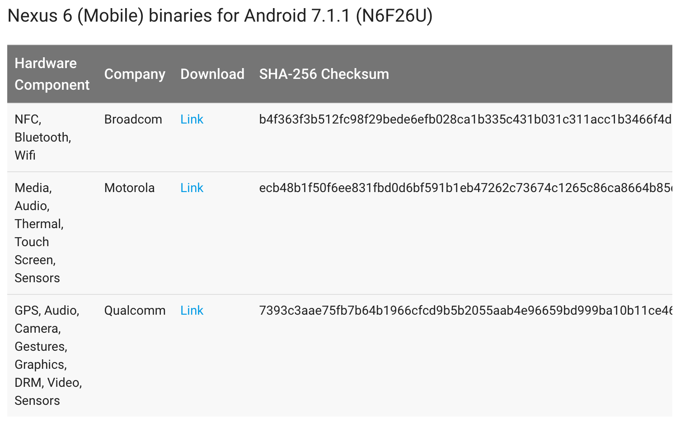

# 编译Android源码

## 说明
本教程演示如何编译 Android 源码，目的是教会你如何基于aosp(Android open source project)定制Android系统。教程演示所使用的手机是Nexus6，但本教程是通用教程，并不局限于Nexus6，只要你有合适的驱动包，你就可以面向任意机型做定制。

## 推荐学习机型

* Nexus 5X
* Nexus 6
* Nexus 6P
* Nexus 9
* Nexus Player
* Pixel
* Pixel C
* Pixel XL

## 基本硬件要求
名称 | 需求
--- | ---
电脑CPU | 双核4线程2GHz或者更高配置的CPU
电脑内存 | 16G物理内存
电脑磁盘 | 至少200G可用的磁盘空间，固态硬盘更好
电脑操作系统 | Ubuntu 16.04
Android手机 | Google Nexus 6

## 准备Ubuntu环境

1. 全新安装Ubuntu 16.04 操作系统（安装到虚拟机也可以，至少为虚拟机分配16G内存，否则容易出错，这可能要求你的宿主计算机具有24G以上的物理内存）
2. 执行如下命令进行更新  
    ``` 
    sudo apt-get update
    ```
3. 执行如下命令安装jdk8  
    ``` 
    sudo apt-get install openjdk-8-jdk
    ```
4. 执行如下命令安装依赖项  
    ``` 
    sudo apt-get install git-core gnupg flex bison gperf build-essential zip curl zlib1g-dev gcc-multilib g++-multilib libc6-dev-i386 lib32ncurses5-dev x11proto-core-dev libx11-dev lib32z-dev ccache libgl1-mesa-dev libxml2-utils xsltproc unzip
    ```
5. 如果想使用SELinux tool 则还应该安装 python-networkx ，通过执行如下命令进行安装  
    ``` 
    sudo apt-get install python-networkx
    ```
6. 如果使用LDAP，则还应该安装 libnss-sss:i386 ，通过如下命令进行安装  
    ``` 
    sudo apt-get install libnss-sss:i386
    ```
7. Ubuntu默认不允许普通用户使用USB，所以还应该配置Android USB设备能够被当前用户访问到，则需要执行如下命令  
    ```
    wget -S -O - http://source.android.com/source/51-android.rules | sed "s/<username>/$USER/" | sudo tee >/dev/null /etc/udev/rules.d/51-android.rules; sudo udevadm control --reload-rules
    ```  
    **注意：执行该命令需要翻墙**
    
## 安装并配置代码管理工具 repo

1. 在当前用户目录下创建 bin 目录，可通过如下命令创建  
    ```
    mkdir ~/bin
    ```
2. 通过如下命令下载 repo ，并将其放在 ~/bin 目录中  
    ``` 
    curl https://storage.googleapis.com/git-repo-downloads/repo > ~/bin/repo
    ```  
   **注意：执行该命令需要翻墙**
3. 通过如下命令给repo添加可执行权限  
    ``` 
    chmod a+x ~/bin/repo
    ```
4. 通过如下命令初始化git用户名  
    ```
    git config --global user.name "Your Name"
    ```
5. 通过如下命令初始化git邮箱  
    ``` 
    git config --global user.email "you@example.com"
    ```
    
## 下载Android源代码

1. 创建一个目录用于存放Android源码，如我存放的路径是 /Work/AndroidSource/Nexus6/source ，并使用终端进入该目录
1. 通过如下代码初始化 Nexus 6 源码仓库  
    ```  
    repo init -u https://android.googlesource.com/platform/manifest -b android-7.1.1_r28
    ```  
    其中 -b 参数指明将下载的代码分支
    如果要下载master分支，则不需要加任何参数，则执行的命令如下  
    ```  
    repo init -u https://android.googlesource.com/platform/manifest
    ```  
    您也可以根据自己的需要来选择合适的分支进行下载，分支与匹配机型参考表网址是  
    http://source.android.com/source/build-numbers.html#source-code-tags-and-builds  
    **注意：访问该网址需要翻墙**
2. 执行如下命令下载（同步）代码  
    ```  
    repo sync
    ```
    目前默认使用4个任务同步代码，如果你的机器足够好，可以指定更多的任务，如下命令演示使用8个任务同步代码  
    ```  
    repo sync -j8
    ```  
    **说明：同步代码可能需要很长时间，你需要一个较好的网络环境和一个较稳定的翻墙工具，按平均状况来看大约需要2天时间，视频教程里有介绍如何使用我已经下载好的用百度云共享的代码，好的网络环境和好的电脑配置可在2小时内完成该任务**
    
## 配置厂商提供的驱动

1. 访问页面 https://developers.google.com/android/drivers 查找配置自己机型的驱动（我这里查找的是Nexus 6的驱动）  
    **注意：访问该页面需要翻墙**
2. 下载 Nexus6 驱动包，如下图所示这三项均需下载  
    
3. 驱动包文件都是压缩包，在压缩包中包括一个sh文件，该sh文件为自解压脚本，分别将这3个sh文件放在Android源码树的根目录，比如/Work/AndroidSource/Nexus6/source，并执行依次执行这3个文件以自动配置驱动包，配置完成后将在源码树根目录中多出一个vendor目录。  
    **注意：在执行3个sh文件时会呈现协议条款，请慢慢看，不要跳过I ACCEPT那一步，否则不解压**
    
## 编译Android源码

1. 执行如下命令进行清理  
    ```  
    make clobber
    ```
2. 执行如下命令加载环境变量  
    ```  
    source build/envsetup.sh
    ```
3. 执行如下命令选择构建目标  
    ```  
    lunch aosp_shamu-userdebug
    ```
    如果想选择其它目标，请直接执行 `lunch` ，将会呈现一个目标列表，可根据自己的手机型号进行选择，如果只想运行在模式器中，可以选择第一项或者直接执行 `lunch aosp_arm-eng` 。
4. 执行如下命令进行编译  
    ```
    make -j4
    ```
    该命令使用4个任务进行编译，如果电脑不够好，编译过程可能会持续10小时或更久，如果电脑足够好，也可以指定更多任务，如 `make -j32` 是指定32个任务进行编译。

## 编译必备的工具

说明：如果你已经安装Android sdk，也可以使用sdk内置的命令。

1. 执行如下命令编译 adb  
    ```
    make adb
    ```
2. 执行如下命令编译 fastboot  
    ```
    make fastboot
    ```
    
## 运行

1. 进入手机 `设置 -> 开发者选项` （如果没有该选项，请进入 `设置 -> 关于手机`，连续点击 `Build number` 7次以启用开发者模式），启用USB调试和OEM解锁
2. 将手机通过USB连接电脑，执行命令 `adb reboot bootloader` 以进入手机的Bootloader模式，也可以通过手机硬键操作进入Bootloader模式，查看不同手机操作方式列表请访问 http://source.android.com/source/running.html （**注意：访问该网址需要翻墙**）。
3. 解锁Bootloader，执行命令 `fastboot flashing unlock` ，2014年或更老的手机请执行 `fastboot oem unlock` ，你必须通过手机屏幕确认该操作。
4. 执行如下命令格式化缓存  
    ```
    fastboot format cache
    ```
5. 执行如下命令格式化用户数据  
    ```
    fastboot format userdata
    ```
6. 执行如下命令将系统写入手机  
    ```
    fastboot flashall -w
    ```
    写入成功后手机将重启进入您编译的操作系统
7. 如果您想长期安全的使用该手机，可以通过命令 `fastboot flashing lock` 锁定Bootloader，2014年或更老的手机请执行 `fastboot oem lock` ，之后进入手机系统，在开发者选项中取消OEM解锁。

## 附

* [Android源码打包下载地址](https://pan.baidu.com/s/1kUAj9kF)  
